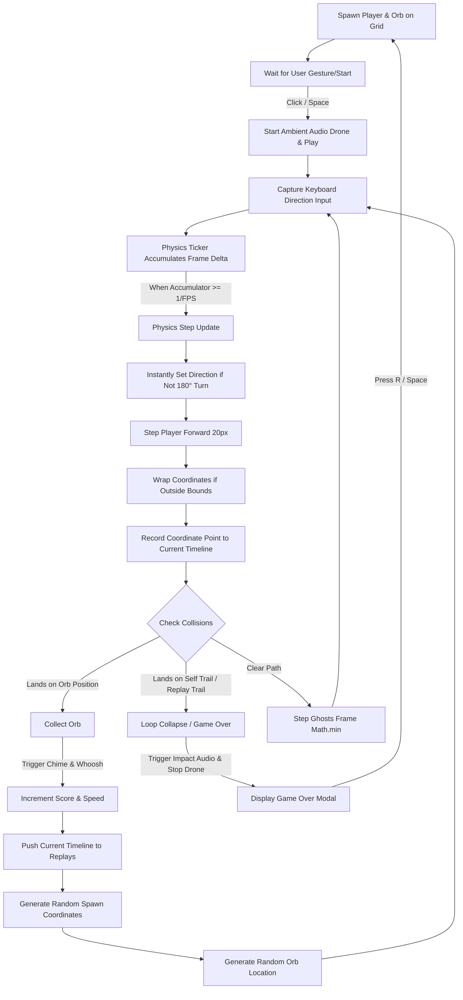

# ECHO - Sketchbook Time-Rewind Arcade Game

> **Made by The Father of Initiative**
> *Every loop leaves a memory.*

A cute, stylized 2D grid-based arcade game where every collected star rewinds time and spawns a sketchy colored-pencil ghost of your previous run. Navigate an increasingly crowded sketchbook paper world filled with your own past decisions!

---

## 🎮 Gameplay & Rules

- **Objective**: Collect as many rotating golden stars as possible before colliding with your own trail or any of your past ghost runs.
- **Classic Grid Movement**: The snake moves strictly on a 20-pixel grid, turning instantly (no steering curves). direct 180-degree backtracks are locked to prevent self-collision.
- **Dynamic Difficulty**: Every successful loop increases the snake's speed (`8.0 + score * 0.85` steps per second).
- **Wall Teleportation**: Going off any screen edge teleports you instantly to the opposite side of the page (screen wrapping).
- **Ghost Graveyard**: Replay ghosts trace their recorded coordinates, but once they reach the end of their recording (where they collected their orb), they **freeze in place** as static obstacles.

---

## ⌨️ Controls

| Action | Input | Description |
|---|---|---|
| **Move / Turn** | `W` `A` `S` `D` / Arrow Keys | Instantly redirects heading angle |
| **Start / Restart**| `Space` | Play/Restart from Menu or Game Over screens |
| **Quick Reset** | `R` | Instantly restarts game from any state |
| **Pause / Resume** | `Escape` | Toggles gameplay pause overlay |

---

## 🛠️ Architecture & Technical Stack

The game is built with a lightweight, performant stack running entirely on the client side:

1. **Frontend**: Next.js 16 (Turbopack) & React 19 (TypeScript)
2. **State**: Zustand (Atomic 60Hz physics ticker, wrapping, and exact grid collision checking)
3. **Graphics**: Rough.js (SVG and HTML5 Canvas drawing engines rendering paper grid textures, sketchy outlines, and pencil-hachure fill styling)
4. **Audio**: Web Audio API (procedurally synthesized ambient drone, crystal chime, rising loop whoosh, and low-frequency thud impact)

---

## 📊 Core Game Loop Diagram

The diagram below details the state machine and tick sequence run by the game loop:



---

## 🚀 Running Locally

To start the game server in your local environment, install dependencies and run:

```bash
npm install
npm run dev
```

Then open your browser and navigate to `http://localhost:3000`.
